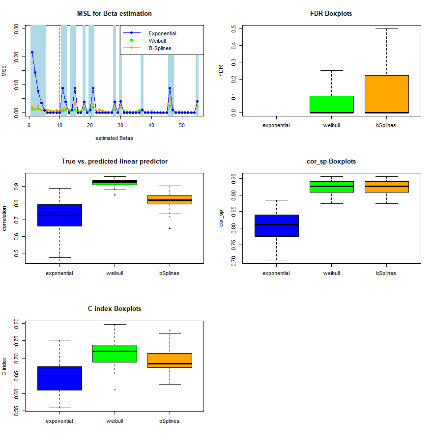
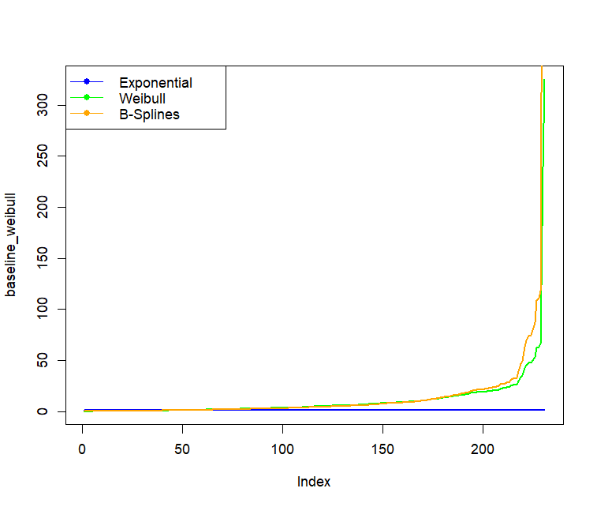
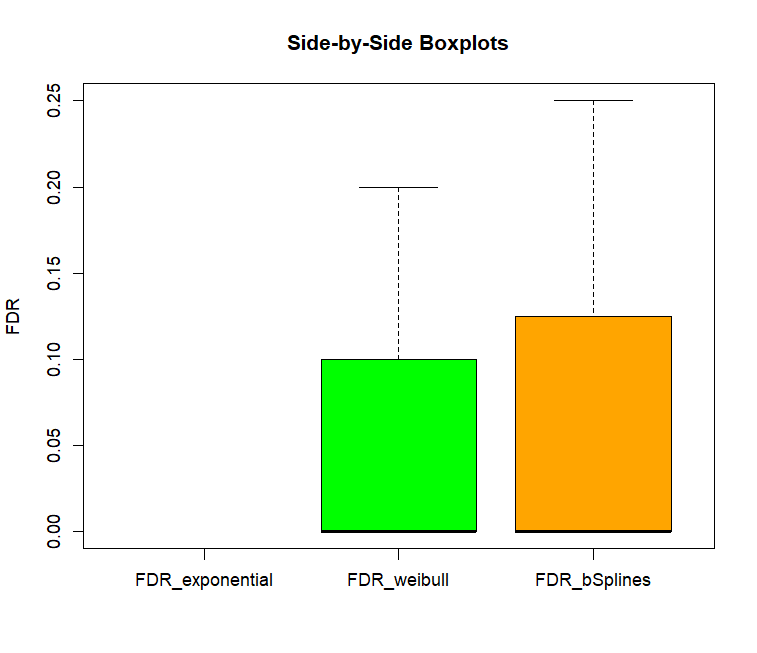

# Bayesian survival analysis under high-dimensional setting

   

## Overview
This repository aims to detect the interaction effects for time-to-event data under high-dimensional setting. 

This project is updated from codes used in my Master work in Statistics & Data Science and aims to address the following research related questions:
1. The reformulated *Bayint* model for time-to-event data;
2. Its potential pros and cons compared to tree-based machine learning methods;
3. An effective approach to estimate interaction effects for time-to-event data with a moderate n to p ratio.

## Table of Contents

- [Requirments](#Requirments)
- [Installation](#Installation)
- [Project structure](#Project-structure)
- [Resuls on the simulated data](#Results-on-the-simulated-data)
- [Results on the real-world data](#Results-on-the-real-world-data)

## Requirments
To run this Project, you will need the following:
- R (> 3.6)
<!-- - lmer (install.library("lmer")) 
- lmerTest (install.library(")) --> 

## Installation

## Project structure 
### Code
#### Stan model:
- `.\stan_files\exponential_est.stan`: setting up bayesian survival model with the assumption of exponential baseline hazard function;
- `.\stan_files\weibull_est.stan`: setting up bayesian survival model with the assumption of weibull baseline hazard function;
- `.\stan_files\bSpline_est.stan`:

#### Stan data constructor
- `.\function_file\exponential_stan_constructor.R`: setting up the stan_data structure for `exponential_est.stan`;
- `.\function_file\weibull_stan_constructor.R`: setting up the stan_data structure for `weibull_est.stan`;
- `.\function_file\bSpline_stan_constructor.R`: setting up the stan_data structure for `bSpline_est.stan`.

#### Other supporting functions
- `.\function_file\Functions.R`: Functions being used when constructing the stan_data, model diagnosis and model performance evaluation.

### Report
The report of this project is now underdrafting.

## Validating the method:
The method was validated from two following perspectivess. 
1. `Model diagnosis`: The model diagnosis focused on two levels: (1) MCMC convergence; and (2) model assumption check;

2. `Model performance`: The model performance focused on three levels: (1) parameter estimation estimation; (2) survival probability prediction; and (3) variable selection.

## Results on the simulated data:
With the listed code, [a simulated bayesian survival analysis](./Sim_data_Analysis.Rmd) (i.e., a bayesian survival model for time-to -event data under high-dimensional setting was conducted on a simulated dataset) was conducted to validate the research setting. The simulated data can be obtained from the file of [Simulated_Data](./Data/imputed_NOTR_DGF.rds), in which a weibull baseline hazard function were assumed. With this simulated data, the following three models have been built: (1). *the exponential model*; (2) *the weibull model*; and (3) *the bSpline models*. 

*Detailed information about the simulation*:
- number of simultaions: 50
- n = 200;
- p = 10. All two-way interactions are considered, i.e., q = p(p-1)/2 = 45;
- Main effects: $\beta_1 = 0.5$, $\beta_2 = -0.4$,  $\beta_3 =0.3$,  $\beta_4 = 0.2$, $\beta_5 = 0.1$,  $(\beta_j)^{10}_{j = 6} = 0$;
- Six non-zero interactions corresponding to **two** non-zero main effects: $\beta_{12} = 0.3$, $\beta_{13} = 0.2$, $\beta_{15} = -0.1$, $\beta_{23} = -0.1$, $\beta_{24} = 0.3$, $\beta_{34} = 0.2$;
- Four non-zero interactions corresponding to **one** non-zero main effects: $\beta_{16} = 0.3$, $\beta_{19} = 0.2$, $\beta_{36} = -0.2$, $\beta_{47} = 0.1$;
- Three non-zero interactions corresponding to **no** non-zero main effects: $\beta_{67} = 0.3$, $\beta_{68} = 0.1$, $\beta_{9, 10} = - 0.2$;
- All 45 - 13 = 32 other interaction parameters $\beta_{jk}$ are set to 0;
- For i = 1, ..., n, $X_i = (x_{i1}, ..., x_{i10})$ ~ MVN(0, $\Sigma$), where $\Sigma$ is covariance matrix with variance equal to 1 and all covariances equals to 0.3;

In summary, $\beta$ = c(0.5, -0.4, 0.3, 0.2, 0.1, 0.0, 0.0, 0.0, 0.0, 0.0,
                              0.3, 0.2, 0.0, -0.1, 0.3, 0.0, 0.0, 0.2, 0.0,
                                   -0.1, 0.3, 0.0, 0.0, 0.0, 0.0, 0.0, 0.0,
                                         0.2, 0.0, -0.2, 0.0, 0.0, 0.0, 0.0,
                                              0.0,  0.0, 0.1, 0.0, 0.0, 0.0,
                                                    0.0, 0.0, 0.0, 0.0, 0.0, 
                                                         0.3, 0.1, 0.0, 0.0,
                                                              0.0, 0.0, 0.0,
                                                                   0.0, 0.0,     -0.2)

*Results of the simulation*:
- The MSE for estimated Beta:

- The baseline hazard:

- The FDR for estimated Beta:

- The $MSE_p$ for predicted survival probability:
?? *Is that necessary to use cross-validation in the simulation data?*
**Using many rounds of simulations would be enough**.

## Results on the real-world data:
The propsed method was also [validated on real-world data](./Real_data_Analysis.Rmd). See the model evaluation results as following:

## Plan
1. To compare with vs. without shrinkage; 
2. To look at the data; 
doner type * doner sex (exist)
doner sex * doner age (within doner type: less sure)

1. start with strafied datasets (i.e., DBD, DCD for both strata)
After being straftied, What are all interactions with donor sex within DBD. 

C index, brier score (test data) 