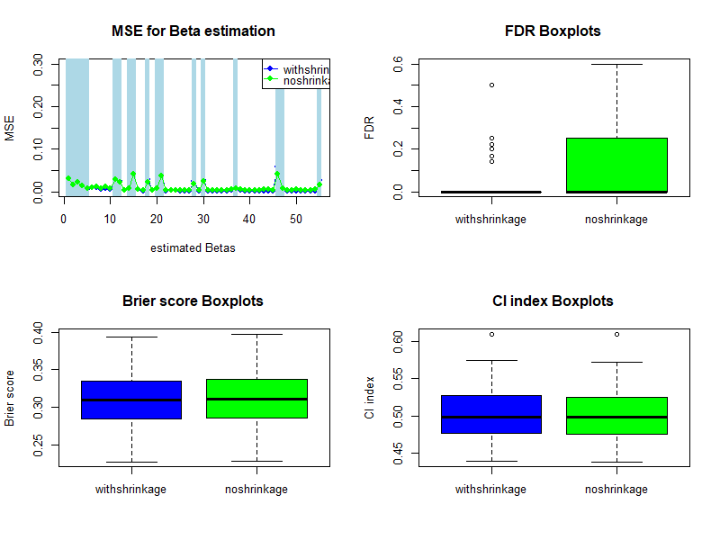

# Linked shrinkage prior: a Bayesian approach to detect interaction effects in survival analysis

   

## Overview
This repository aims to detect the interaction effects for time-to-event data under high-dimensional setting. 

This project is updated from codes used in my Master work in Statistics & Data Science and aims to address the following research related questions:
1. The reformulated *Bayint* model for time-to-event data;
2. Its potential pros and cons compared to tree-based machine learning methods;
3. An effective approach to estimate interaction effects for time-to-event data with a moderate n to p ratio.

## Table of Contents

- [Requirments](#Requirments)
- [Installation](#Installation)
- [Project structure](#Project-structure)
- [Project report](#Project-report)

## Requirments
To run this Project, you will need the following:
- R (> 3.6)
- rstan
- MASS
- rstantools
- coda
- readr
- survival
- splines2
- dplyr
- simsurv
- Hmisc
- caret

## Installation
No installation
## Project structure
### Project description
This project aims to reformulate ***linked shrinkage prior*** in Bayesian Survival model to improve its ability of detecting interaction effects. The reformulated method is first validated on the simulated data and then on the real-world data.

### Code
#### stan_file:
- `.\stan_file\A_estBC.stan`: setting up bayesian survival model (linked shrinkage) with approach A of baseline hazard function, with B and C (no shrinkage).

#### function_file:
- `.\function_file\stan_constructor.R`: constructing stan_data for each model.
- `.\function_file\Functions.R`: other functions that are useful for this modelling.

#### actucal code：
- `.\01_Sim_data_Analysisbaseline.Rmd`: To verify the following models on the simulated data: Different ways to approach baseline hazard function in Bayesian survival models with linked shrinkage priors 
- `.\02_Sim_dataAnalysis_shrinkagewn.Rmd`: To verify the following models on the simulated data: Bayesian survival models with linked shrinkage priors versus no shrinkage priors. Only partical likelihood and full likelihood with bSplines method to approach baseline hazard function be accounted for.
- `04_Real_data_AnalysisCombined_final.Rmd`: To verify the following models on the real-world data:  Bayesian survival models with linked shrinkage priors versus no shrinkage priors. Only partical likelihood and full likelihood with bSplines method to approach baseline hazard function be accounted for.

## Project report
The report of this project can be seen in [report](./Report.pdf).
A sample of results can been in [Example Figure](./Image/sim_50_intshrinkagePH.png) as follows:

<!-- ## Validating the method:
The method was validated from two following perspectivess. 
1. `Model diagnosis`: The model diagnosis focused on two levels: (1) MCMC convergence; and (2) model assumption check;

2. `Model performance`: The model performance focused on three levels: (1) parameter estimation estimation; (2) survival probability prediction; and (3) variable selection.

## method on the simulated data:
With the listed code, [a simulated bayesian survival analysis](./01_Sim_data_Analysisbaseline.Rmd) (i.e., a bayesian survival model for time-to -event data under high-dimensional setting was conducted on a simulated dataset) was conducted to validate the research setting. In the simulated, a weibull baseline hazard function were used. With this simulated data, the following three models have been built: (1) *the exponential model*; (2) *the weibull model*; and (3) *the bSpline models*. 

***Detailed information about the simulation***:
- number of simultaions: 50
- n = 200;
- p = 10. All two-way interactions are considered, i.e., q = p(p-1)/2 = 45;
- Main effects: $\beta_1 = 0.5$, $\beta_2 = -0.4$,  $\beta_3 =0.3$,  $\beta_4 = 0.2$, $\beta_5 = 0.1$,  $(\beta_j)^{10}_{j = 6} = 0$;
- Six non-zero interactions corresponding to **two** non-zero main effects: $\beta_{12} = 0.3$, $\beta_{13} = 0.2$, $\beta_{15} = -0.1$, $\beta_{23} = -0.1$, $\beta_{24} = 0.3$, $\beta_{34} = 0.2$;
- Four non-zero interactions corresponding to **one** non-zero main effects: $\beta_{16} = 0.3$, $\beta_{19} = 0.2$, $\beta_{36} = -0.2$, $\beta_{47} = 0.1$;
- Three non-zero interactions corresponding to **no** non-zero main effects: $\beta_{67} = 0.3$, $\beta_{68} = 0.1$, $\beta_{9, 10} = - 0.2$;
- All 45 - 13 = 32 other interaction parameters $\beta_{jk}$ are set to 0;
- For i = 1, ..., n, $X_i = (x_{i1}, ..., x_{i10})$ ~ MVN(0, $\Sigma$), where $\Sigma$ is covariance matrix with variance equal to 1 and all covariances equals to 0.3;

In summary, $\beta$ = c(0.5, -0.4, 0.3, 0.2, 0.1, 0.0, 0.0, 0.0, 0.0, 0.0,
                              0.3, 0.2, 0.0, -0.1, 0.3, 0.0, 0.0, 0.2, 0.0,
                                   -0.1, 0.3, 0.0, 0.0, 0.0, 0.0, 0.0, 0.0,
                                         0.2, 0.0, -0.2, 0.0, 0.0, 0.0, 0.0,
                                              0.0,  0.0, 0.1, 0.0, 0.0, 0.0,
                                                    0.0, 0.0, 0.0, 0.0, 0.0, 
                                                         0.3, 0.1, 0.0, 0.0,
                                                              0.0, 0.0, 0.0,
                                                                   0.0, 0.0,     -0.2)

***Results of the simulation***:

 (6*8 inch)

***Relevant questions in this section***:
1. *Is that necessary to use cross-validation in the simulation data?*
**Using many rounds of simulations would be enough**.

2. *Do we need to check model convergence in each simulation?*

## bSpline log baseline hazard with vs. without Bayesian shrinkage for interactions
With a similar simulation setting, [bSpline log baseline hazard with vs. without Bayesian shrinkage for interactions](./02_Sim_dataAnalysis_shrinkagewn.Rmd) was conducted to investigate the advantages vs. disadvantages in between them. 

*Results of the simulation*:

## Results on the real-world data:
The propsed method was also [validated on real-world data](./Real_data_Analysis.Rmd). See the model evaluation results as following:

## Plan
1. To compare with vs. without shrinkage; 
2. To look at the data; 
doner type * doner sex (exist)
doner sex * doner age (within doner type: less sure)

1. start with strafied datasets (i.e., DBD, DCD for both strata)
After being straftied, What are all interactions with donor sex within DBD. 

C index, brier score (test data)  -->
